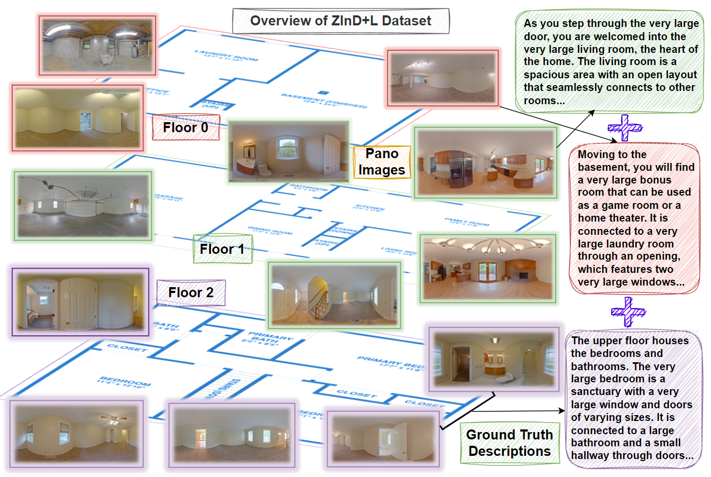
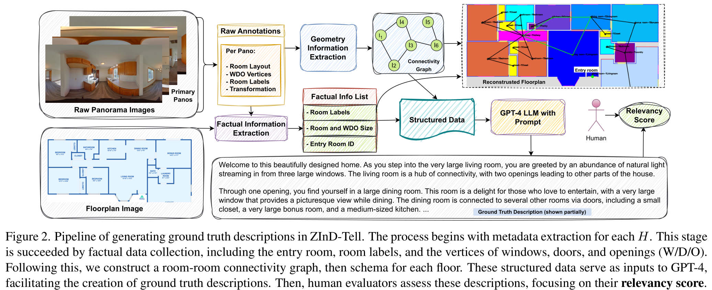
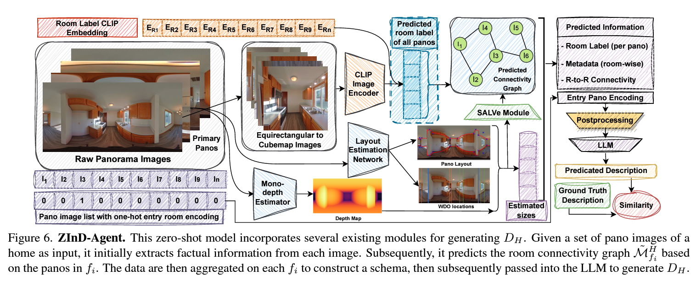

# ZInD-Tell: Towards Translating Indoor Panoramas into Descriptions
This repository contains code for our IEEE International Conference on Computer Vision and Pattern Recognition Workshop (CVPRW) on Multimodal Learning and Applications (MULA) paper: [ZInD-Tell: Towards Translating Indoor Panoramas into Descriptions](https://openaccess.thecvf.com/content/CVPR2024W/MULA/html/Deb_ZInD-Tell_Towards_Translating_Indoor_Panoramas_into_Descriptions_CVPRW_2024_paper.html).

## Our paper
### Introduction

This paper focuses on bridging the gap between natural language descriptions, 360-degree panoramas, room shapes, and layouts/floorplans of indoor spaces. To enable new multi-modal (image, geometry, language) research directions in indoor environment understanding, we propose a novel extension to the Zillow Indoor Dataset (ZInD) which we call ZInD-Tell. We first introduce an effective technique for extracting geometric information from ZInD's raw structural data, which facilitates the generation of accurate ground truth descriptions using GPT-4. A human-in-the-loop approach is then employed to ensure the quality of these descriptions. 

To demonstrate the vast potential of our dataset, we introduce the ZInD-Tell benchmark, focusing on two exemplary tasks: language-based home retrieval and indoor description generation. Furthermore, we propose an end-to-end, zero-shot baseline model, ZInD-Agent, designed to process an unordered set of panorama images and generate home descriptions. ZInD-Agent outperforms naive methods in both tasks, hence, can be considered as a complement to the naive to show potential use of the data and impact of geometry.

We believe this work initiates new trajectories in leveraging Computer Vision techniques to analyze indoor panorama images descriptively by learning the latent relation between vision, geometry, and language modalities.


<div align="center">
    
    <br><br>
</div>
Our major technical contributions are:

- Creating ZInD-Tell, the first ever large-scale dataset that includes natural language descriptions of indoors, layouts and panoramic images, by enhancing the well-established Zillow Indoor Dataset [ZInD](https://github.com/zillow/zindtell).
- Offering a thorough statistical analysis and human evaluations of the dataset to assess the quality.
- Proposing ZInD-Agent, a zero-shot baseline model, for generating home descriptions from panorama images.
- Benchmarking ZInD-Tell dataset by comparing ZInD-Agent's performance with naïve baselines across two tasks: generation and retrieval.


### Dataset Generation and Evaluation

The raw datasets are pre-processed to meet geometric constraints and key information is extracted from human annotations. We then use GPT-4 to automate description generation with a template-based schema. Finally, human evaluations ensure the descriptions match the homes accurately. The overall pipeline is shown below:

<div align="center">
    
</div>

### Dataset Evaluation

To test our ZinD-Tell dataset, we propose two tasks. First, language-based home retrieval: the model retrieves the home that best matches a given description. Second, description generation from panorama images: the model generates descriptions from unordered indoor panorama images of each floor, learning the semantic connections between rooms and floors.

We introduce a zero-shot baseline model, ZInD-Agent. This model uses existing pre-trained components. Its main goal is to set a baseline for further research. ZInD-Agent generates descriptions from unordered 360-degree panorama images, aiming to match the target descriptions. It has multiple modules that work together on the images for each feature to produce the final descriptions end-to-end. Module-wise performance is discussed in the supplementary material. The framework and pipeline is shown below:

<div align="center">
    
</div>

## ZInD-Tell Dataset
The dataset and code will be available soon. Feel free to send email if you have any questions!

## Zero-Shot Baseline (ZInD-Agent) Code
The dataset and code will be available soon. Feel free to send email if you have any questions!

## Authors
* **Tonmoay Deb**, Northwestern University
    * Website: [https://tonmoay.de](https://tonmoay.de/)
    * Email: tonmoay.deb@northwestern.edu
* **Lichen Wang**, Zillow Group
    * Website: [https://sites.google.com/site/lichenwang123](https://sites.google.com/site/lichenwang123/)
    * Email: lichenw@zillowgroup.com
* **Zachary Bessinger**, Zillow Group
    * Website: [https://zachbessinger.com](https://zachbessinger.com/)
    * Email: zacharybe@zillowgroup.com
* **Naji Khosravan**, Zillow Group
    * Website: [https://www.najikhosravan.com](https://www.najikhosravan.com/)
    * Email: najik@zillowgroup.com
* **Eric Penner**, Zillow Group
    * LinkedIn: [https://www.linkedin.com/in/epenner1](https://www.linkedin.com/in/epenner1/)
    * Email: ericpe@zillowgroup.com
* **Sing Bing Kang**, Zillow Group
    * Website: [https://www.singbingkang.com](https://www.singbingkang.com/)
    * Email: singbingk@zillowgroup.com
## Citation
```
@inproceedings{zindtell,
  title={ZInD-Tell: Towards Translating Indoor Panoramas into Descriptions},
  \author{Deb, Tonmoay and Wang, Lichen and Bessinger, Zachary and Khosravan, Naji and Penner, Eric and Kang, Sing Bing},
  booktitle={{IEEE/CVF} Conference on Computer Vision and Pattern Recognition,{CVPR} 2024 - Workshops, Seattle, WA, United States, June 17-24, 2024},
  year={2024}
}
```
